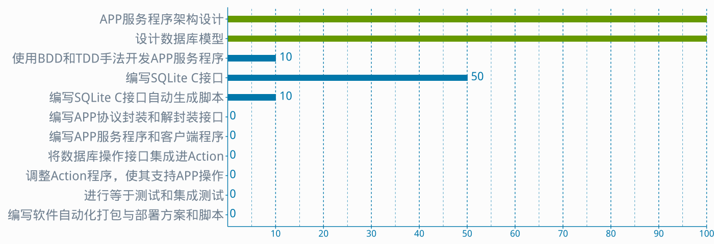

Overview and snapshot
=====================

This template provide some useful features as following:

* Pure and fresh layout;
* Powerful TOC(Table Of Conent), powered by [Bootstrap](http://www.bootcss.com/);
* UTF-8 encoding(Such as Chinese) for figures generated by [Knitr](http://www.yihui.name/knitr);
* Go-To-Top and Full-Screen button;
* [Prism](http://www.prismjs.com) style for Sytax Highlighting;
* Create reference to Table or Figure easily;

Why do I create this template
=============================
I would like to write under a quiet and clean environment.


I felt a great affinity with [Markdown](http://daringfireball.net/projects/markdown/syntax) when the first time I met it, 
It is pure and clean, helps me to focus on writing without any other noise.


I use [Pandoc](http://johnmacfarlane.net/pandoc/) to convert the [Markdown](http://daringfireball.net/projects/markdown/syntax) to HTML file usually.
But when I create figure with [R](http://www.r-project.org/), I will use [Knitr](http://www.yihui.name/knitr).


How it works
============
TODO

License
=======
TODO


Exmaples
========

Sytax Highlighting
------------------
I will write some code in this section.

A simple C code fragment.
```{.c .numberLines}
#include <stdio.h>

#define PI 3.1415

/**
  * @brief The entry of this program
  *
  * @param argc counts of argument
  * @param argv argument variables stored in
  *
  * @return EXIT_SUCCESS
  */
int main (void)
{
  const char *str = "Hello world!";
  if (36877)
  {
    //Print "Hello world!"
    printf ("%s\n", str);
  }
  return EXIT_SUCCESS;
}
```


This R code will genreate [Fig2](#Fig2).
```{.r .numberLines startFrom="381"}
data <- read.csv("analysis.csv", header=TRUE, nrows=200, encoding="utf-8", 
                  fileEncoding="utf-8", stringsAsFactors = FALSE)

#1. Input data
#2. Setup bar width and color
#3. Flip X and Y coordinarate
#4. Intesect axis to origin

data$Done <- rev(data$Done)
data$Description <- rev(data$Description)
ggplot(data, aes(x=factor(Description, 
                 levels=unique(Description)), y=Done)) + 

    geom_bar(fill=ifelse(data$Done == 100, "#669900", "#0077AA"), width=.3, 
                         stat="identity", 
                          position = position_dodge(width = 0.1)) + 

    coord_flip() +  

    scale_y_continuous(limits = c(0, 100), expand = c(0, 0), 
                       breaks=c(10, 20, 30, 40, 50, 60, 70, 80, 90, 100)) +

    geom_text(aes(label = Done), vjust = 0.3, hjust = -0.3,
              colour = "#0077AA", size = 8) +

    theme_pandoc()

dev.off()
```
 

Reference to Table
------------------

Tables  Are     Cool
------  ------  ------  
11      12      13
21      22      33
31      32      33

:Table1 An table example[^1]


------  ------  ------  ---
11      12      13        1
21      22      33        2
31      32      33        3
------  ------  ------  ---

:Table2 Another table example

The reference to tables are [Table1](#Table1) and [Table2](#Table2).


Reference to Figure
-------------------
On the first section you see [Fig1](#Fig1), and it's a simple reference way to use.

And [Fig2](#Fig2) is another figure.

 


Table Of Content
------------------
This template supports H1 to H6 headers.

### This is a H3 header
Some

Contents

In

This 

Section.

#### This ia a H4 header
This

Section

Is H4 Header


### Another H3 header
Some 

Contents

Too

#### Another H4 header
Ok

Write 

Someting

##### Now is H5 header
Write 

Someting

You 

Want

###### Is a H6 header

Foo

Bar

Bala

Bala


##### Another H5 header
Yes

Another H5 header


###### Anoter H6 header

Just

Another

H6 header

Content


[^1]:Just an exmaple.
