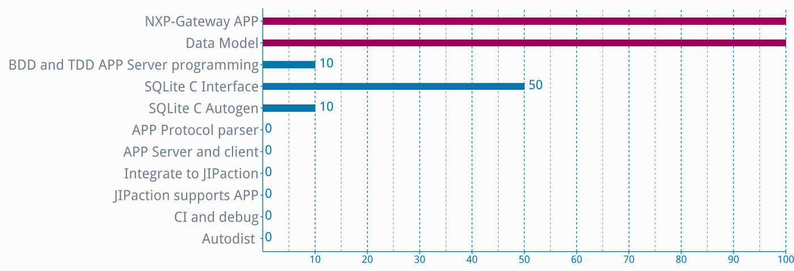

一、代码高亮
=============

> 我要引用一下HTML代码

``` {.html .numberLines startFrom="1"}
<html xmlns="http://www.w3.org/1999/xhtml">
<head>
  <meta http-equiv="Content-Type" content="text/html; charset=utf-8" />
  <meta http-equiv="Content-Style-Type" content="text/css" />
  <meta name="generator" content="pandoc" />
  <title>Hello world</title>
</head>
<body>
<div class="figure">
  <p class="caption">plot of chunk fig-2</p>
  </div>
</body>
</html>
```


> 再引用一下Ruby代码

``` {.ruby .numberLines}
require 'socket'

#Get address from OS
IPSocket.getaddress(Socket.gethostname)
  TCPSocket.gethostbyname(Socket.gethostname)
  output=%x{/sbin/ifconfig}
  p output

  if(TRUE)
    p "OK"
```


> 来个C代码

```{.c .numberLines}
#include <stdio.h>

#define PI 3.1415

/**
  * @brief The entry of this program
  *
  * @param argc counts of argument
  * @param argv argument variables stored in
  *
  * @return EXIT_SUCCESS
  */
int main (void)
{
  const char *str = "Hello world!";
  if (36877)
  {
    //Print "Hello world!"
    printf ("%s\n", str);
  }
  return EXIT_SUCCESS;
}
```

这是R代码
```{.r .numberLines startFrom="381"}
data <- read.csv("analysis.csv", header=TRUE, nrows=200, encoding="utf-8", 
                  fileEncoding="utf-8", stringsAsFactors = FALSE)

#1. Input data
#2. Setup bar width and color
#3. Flip X and Y coordinarate
#4. Intesect axis to origin

data$Done <- rev(data$Done)
data$Description <- rev(data$Description)
ggplot(data, aes(x=factor(Description, 
                 levels=unique(Description)), y=Done)) + 

    geom_bar(fill=ifelse(data$Done == 100, "#669900", "#0077AA"), width=.3, 
                         stat="identity", 
                          position = position_dodge(width = 0.1)) + 

    coord_flip() +  

    scale_y_continuous(limits = c(0, 100), expand = c(0, 0), 
                       breaks=c(10, 20, 30, 40, 50, 60, 70, 80, 90, 100)) +

    geom_text(aes(label = Done), vjust = 0.3, hjust = -0.3,
              colour = "#0077AA", size = 8) +

    theme_pandoc()

dev.off()
```
 
上述代码会生成[图1](#图1)所示的图片


二、R绘制图表
=============


```{r fig.cap='图1 语言生成进度图', utf8 = TRUE}
data <- read.csv("analysis.csv", header=TRUE, nrows=200, encoding="utf-8", fileEncoding="utf-8", stringsAsFactors = FALSE)

#1. Input data
#2. Setup bar width and color
#3. Flip X and Y coordinarate
#4. Intesect axis to origin

data$Done <- rev(data$Done)
data$Description <- rev(data$Description)
ggplot(data, aes(x=factor(Description, levels=unique(Description)), y=Done)) + 
    geom_bar(fill=ifelse(data$Done == 100, "#669900", "#0077AA"), width=.3, stat="identity", position = position_dodge(width = 0.1)) + 
    coord_flip() +  
    scale_y_continuous(limits = c(0, 100), expand = c(0, 0), breaks=c(10, 20, 30, 40, 50, 60, 70, 80, 90, 100)) +
    geom_text(aes(label = Done), vjust = 0.3, hjust = -0.3, colour = "#0077AA", size = 8) +
    theme_pandoc()
dev.off()
```


```{r fig.cap='图2 语言再生成进度图', utf8 = TRUE}
data <- read.csv("analysis-en.csv", header=TRUE, nrows=200, encoding="utf-8", fileEncoding="utf-8", stringsAsFactors = FALSE)

#1. Input data
#2. Setup bar width and color
#3. Flip X and Y coordinarate
#4. Intesect axis to origin

data$Done <- rev(data$Done)
data$Description <- rev(data$Description)
ggplot(data, aes(x=factor(Description, levels=unique(Description)), y=Done)) + 
    geom_bar(fill=ifelse(data$Done == 100, "#990055", "#0077AA"), width=.3, stat="identity", position = position_dodge(width = 0.1)) + 
    coord_flip() +  
    scale_y_continuous(limits = c(0, 100), expand = c(0, 0), breaks=c(10, 20, 30, 40, 50, 60, 70, 80, 90, 100)) +
    geom_text(aes(label = Done), vjust = 0.3, hjust = -0.3, colour = "#0077AA", size = 8) +
    theme_pandoc()
dev.off()
```

参考链接
=========
- [Knitr options](http://yihui.name/knitr/options)  
- [Is there a way to hide figure captions when using knitr and pandoc to create doc](http://stackoverflow.com/questions/21329864/is-there-a-way-to-hide-figure-captions-when-using-knitr-and-pandoc-to-create-doc)

